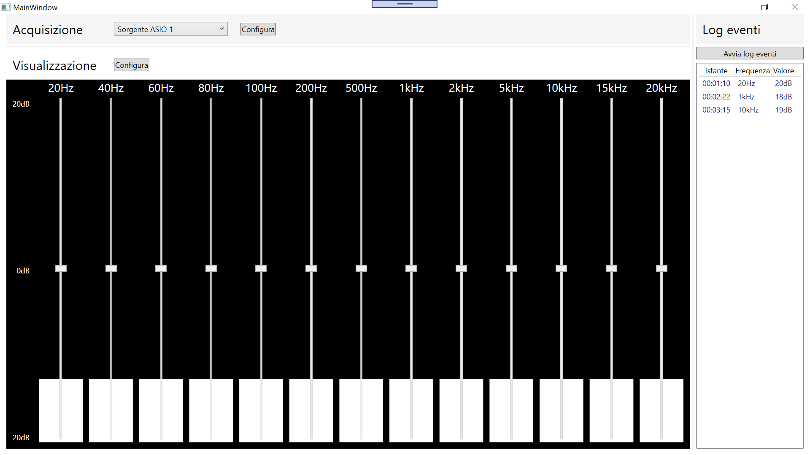

# spectrum-analyzer
Un'applicazione per il progetto #7 dell'hackathon degli Accessibility Days 2020.

## Scopo
Questa applicazione riceve un flusso audio in input e  notifica l'utente quando alcune frequenze superano una certa intensità in decibel. Lo sviluppo è in corso, vedi le [issue](https://github.com/BrightSoul/spectrum-analyzer/issues) per il lavoro che resta da fare. Fork e pull request sono ben accetti.

## Avviare l'applicazione
Questa è un'applicazione WPF che richiede .NET Framework 4.6.1. La versione più recente è disponibile per l'installazione al seguente link:

https://spettro.azurewebsites.net
